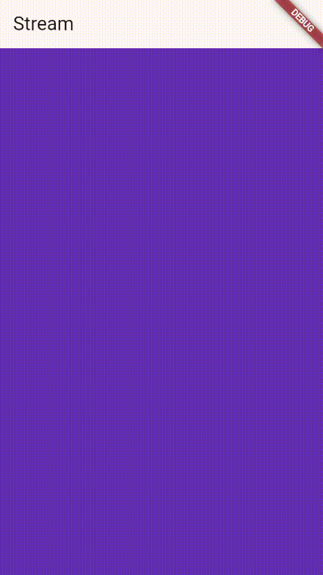
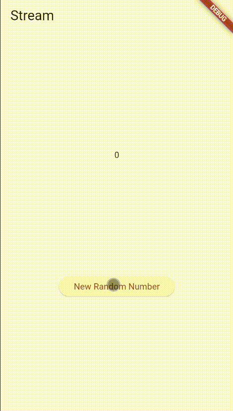
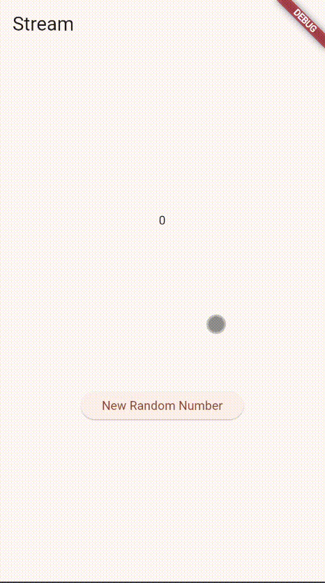
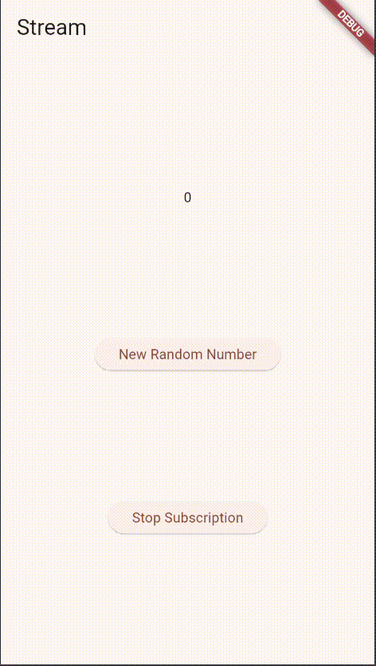
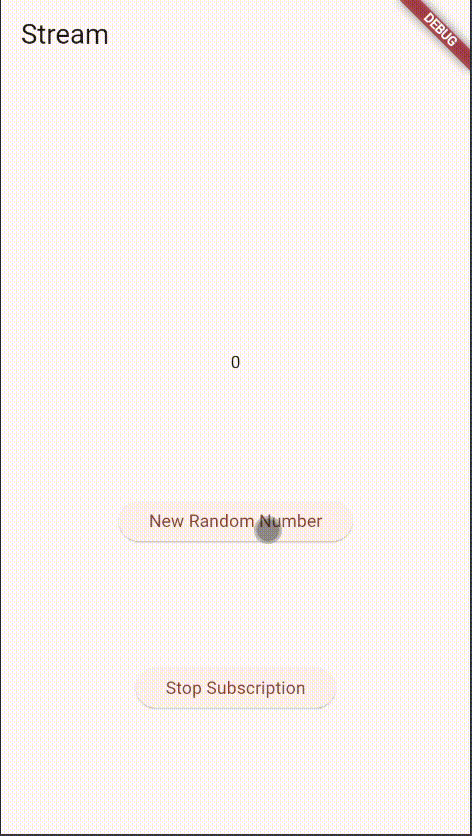

# stream_naufal

# Capture Hasil Praktikum Pertama

# Capture Hasil Praktikum Kedua (Membuat Nomor Random)

# Capture Hasil Praktikum Ketiga (Memunculkan nomor 0 - 90)

# Capture Hasil Praktikum keempat (Menambah dan menghentikan subscription)

# Soal 10
Error itu bisa terjadi dikarena objek Stream hanya mendukung 1 subscription.

# Capture Hasil Praktikum kesebelas (Menambahkan dua subscription)

A new Flutter project.

## Getting Started

This project is a starting point for a Flutter application.

A few resources to get you started if this is your first Flutter project:

- [Lab: Write your first Flutter app](https://docs.flutter.dev/get-started/codelab)
- [Cookbook: Useful Flutter samples](https://docs.flutter.dev/cookbook)

For help getting started with Flutter development, view the
[online documentation](https://docs.flutter.dev/), which offers tutorials,
samples, guidance on mobile development, and a full API reference.
